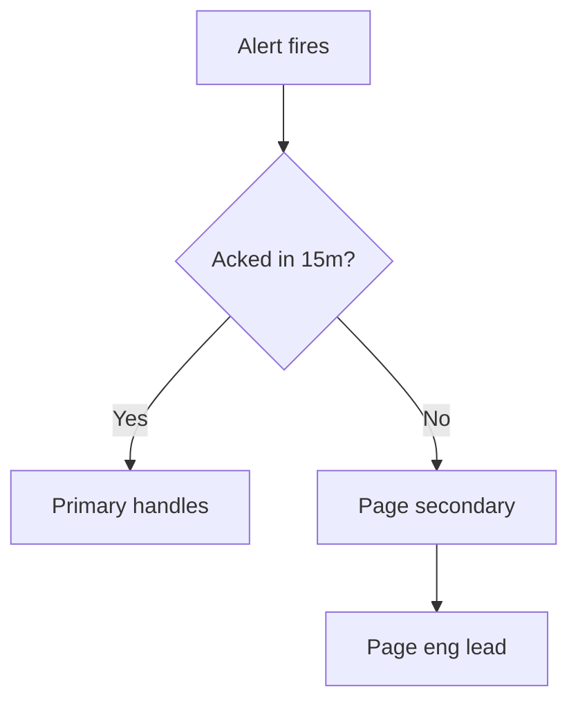

## On-call overview

:::hint{type="danger"}
This document is internal. Do not share the escalation contacts outside the on-call rotation.
:::

:::ExpandableHeading
## Escalation policy

If a P0 is not acknowledged within 15 minutes, page the secondary on-call, then the engineering lead.
:::

## Severity levels

| Level | Response time | Owner |
|---|---|---|
| P0 | 15 min | On-call primary |
| P1 | 1 hour | On-call secondary |
| P2 | Next business day | Team lead |

## Incident board

:::DropList
```json
{
  "columns": [
    {
      "id": "todo",
      "name": "Reported",
      "items": [
        { "id": "i1", "content": "Investigate elevated 5xx on QA", "justAdded": false }
      ]
    },
    {
      "id": "doing",
      "name": "Mitigating",
      "items": [
        { "id": "i2", "content": "Roll back last deploy", "justAdded": false }
      ]
    },
    {
      "id": "done",
      "name": "Resolved",
      "items": []
    }
  ]
}
```
:::

## Escalation flow


